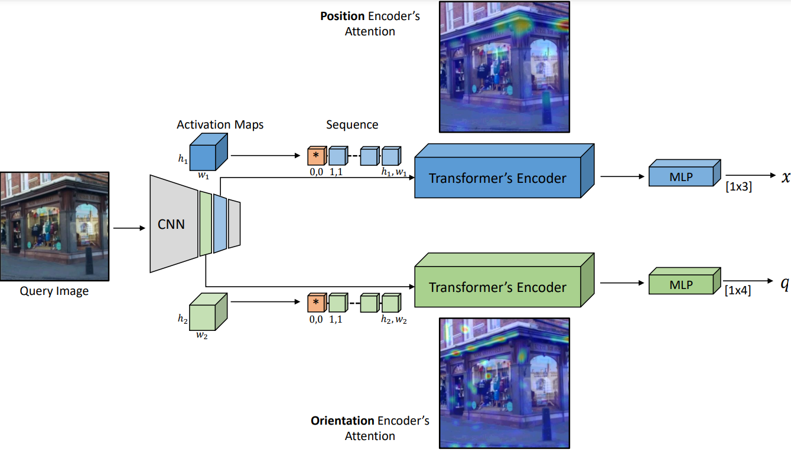

## Learning Single and Multi-Scene Camera Pose Regression with Transformer Encoderr
This repository implements a Transformer-Encoder formulation for learning single- and multi- scene absolute pose regression, described in our paper: **Learning Single and Multi-Scene Camera Pose Regression with Transformer Encoders**.


The figure below illustrates our proposed scheme. The input image is
		first encoded by a convolutional backbone. Two activation maps, at different resolutions, are transformed into sequential representations. The two activation sequences are analyzed by dual Transformer encoders, one per regression task. We depict the attention weights via
		heatmaps. Position is best estimated by corner-like image features,
		while orientation is estimated by edge-like features. Each Transformer encoder output is  used to regress the respective camera pose component (position x or orientation q) 


The above model can be extended for learning multiple scenes in parallel with the ddition of two FC layers, one layer for classifying the scene and a second layer for encoding the scene index before adding it to the learnable tokens:


---

### In a Nutshell

This code implements:

1. Training of a Transformer Encoder -based architecture for absolute pose regression 
2. Training of a PoseNet-like (CNN based) architecture (baseline)
3. Testing of the models implemented in 1-2

---

### Setup

1. Download the [Cambridge Landmarks](http://mi.eng.cam.ac.uk/projects/relocalisation/#dataset) dataset and the [7Scenes](https://www.microsoft.com/en-us/research/project/rgb-d-dataset-7-scenes/) dataset
1. Setup a conda env:
```
conda create -n loc python=3.7
pip install torch==1.4.0 torchvision==0.5.0
pip install scikit-image
pip install efficientnet-pytorch
pip install pandas
conda activate loc
```

---

### Usage

The entry point for training and testing is the main.py script in the root directory

  For detailed explanation of the options run:
  ```
  python main.py -h
  ```
  For example, in order to train TransPoseNet on the ShopFacade scene from the CambridgeLandmarks dataset: 
  ```
python main.py transposenet train ./models/backbones/efficient-net-b0.pth <path to the CambridgeLandmarks dataset> ./datasets/CambridgeLandmarks/abs_cambridge_pose_sorted.csv_ShopFacade_train.csv
  ```
  Your checkpoints (.pth file saved based on the number you specify in the configuration file) and log file
  will be saved under an 'out' folder.
  
  In order to test your model, for example on the the ShopFacade scene:
  ```
python main.py transposenet test ./models/backbones/efficient-net-b0.pth <path to the CambridgeLandmarks dataset> ./datasets/CambridgeLandmarks/abs_cambridge_pose_sorted.csv_ShopFacade_test.csv --checkpoint_path <path to .pth>
  ```
  
 In order to run with different configurations, you should edit ```config.json``` to have the 'transposenet' key point to the desired configuration  
 (configurations are named by their dataset and variant single or multi-scene)

### Pretrained models
we make our multi-scene pretrained models available in order to reproduce results:
1. [Pretrained model for the 7Scenes dataset](https://drive.google.com/file/d/1QE_gEHV46i4K2C_VcJiAdR06dckoMjgr/view?usp=share_link) (MS variant)
2. [Pretrained model for the Cambridge Landmarks dataset](https://drive.google.com/file/d/1BcwAEwnmKlMq6KLmBB1nwPsctjJkwJk4/view?usp=share_link) (MS variant)
  
  
  
  
